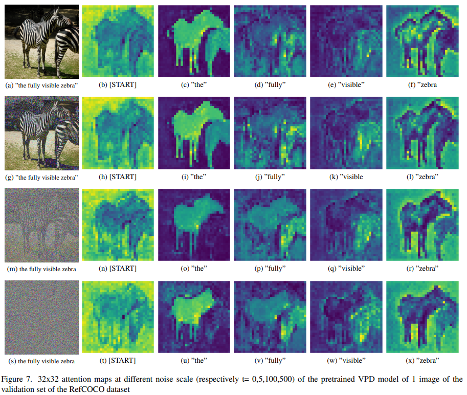

Referring Image Segmentation via Text-to-Image Diffusion Models
This repository showcases the code and models used in our project aimed at enhancing the referring image segmentation task in Visual Perception (VP) models. By building upon the authors' original work, we explored two approaches: freezing the stable diffusion module and introducing variable amounts of noise to the input images. Our findings from examining the model's attention maps provide valuable insights for potential improvements in future research.

Table of Contents
Setting Up the Environment
Training the Frozen VPD Model with Added Noise Scale
Running Inference with Specified Checkpoints
Attention Maps Visualization
 Setting Up the Environment
To get started, ensure all dependencies are installed:

$ cd VPD2/refer
pip install -r requirements.txt

$ cd VPD2/stablediffusion
pip install -r requirements.txt
 Training the Frozen VPD Model with Added Noise Scale
Use the following command to train the frozen VPD model with a custom noise scale value. You may adjust the noise scale value directly in the model_refer folder's model file. The provided training parameters remain unchanged.

$ python VPD2/refer/my_train.py \
--dataset refcoco \
--split val \
--epochs 1 \
--batch-size 4 \
--workers 4 \
--img_size 512
 Running Inference with Specified Checkpoints
Once training is complete, execute inference using a designated checkpoint:

$ python VPD2/refer/my_test.py \
--dataset refcoco \
--split val \
--epochs 1 \
--workers 4 \
--img_size 512
 Attention Maps Visualization
Below are the attention maps generated during inference, illustrating the impact of adding different levels of noise to the input image:

